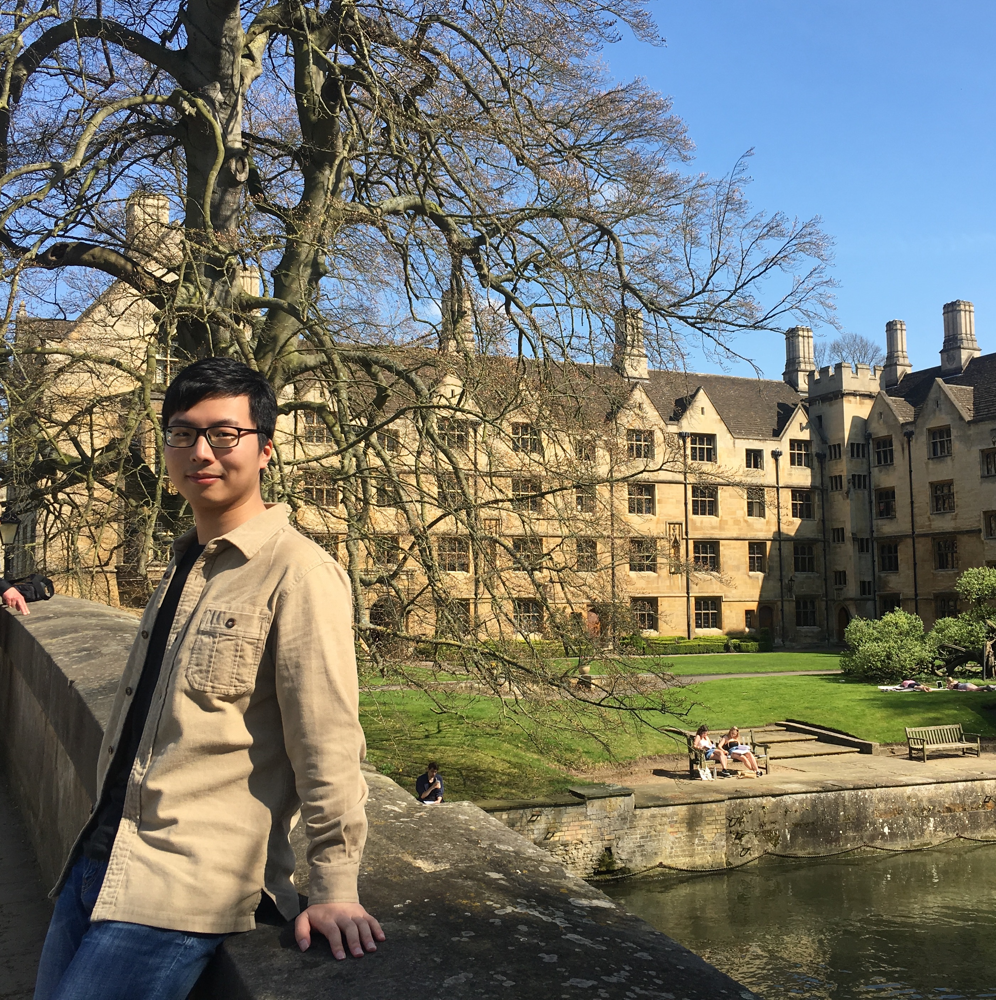

## ABOUT ME

Hi! I am a first-year PhD student in Natural Language Processing at the University of Edinburgh. I am affiliated with [the Institute for Language, Cognition and Computation (ILCC)](http://web.inf.ed.ac.uk/ilcc) and [the Edinburgh Natural Language Processing Group (EdinburghNLP)](http://edinburghnlp.inf.ed.ac.uk/). I am fortunate to be supervised by [Prof. Mirella Lapata](http://homepages.inf.ed.ac.uk/mlap/) (principle) and [Dr. Shay Cohen](http://homepages.inf.ed.ac.uk/scohen/).

## RESEARCH INTEREST

I am interested in both deep learning techniques and probabilistic models for NLP tasks, including text summarisation, machine translation and opinion mining. My long-term goal is to combine the two approaches properly for NLP applications. I am currently working on Neural Variational Inference (NVI).

## EDUCATION

Feb. 2018 - Present  
Ph.D. student, ILCC, **The University of Edinburgh**  
- Specialisation area: text summarisation  
- Supervisor: Prof. Mirella Lapata and Dr. Shay Cohen  
- Funder: [IARPA](https://www.iarpa.gov/)

Sept. 2016 - Nov. 2017  
M.S. (with Distinction), School of Informatics, **The University of Edinburgh**  
- Specialisation area: NLP and machine learning  
- Supervisor: Dr. Shay Cohen

Sept. 2012 - July 2016  
B.S., School of Informatics, **University of International Business and Economics**  
- Specialisation area: text mining and social computing  
- Supervisor: Prof. Bing Li

Feb. 2015  
Winter session, **HongKong University**

July 2014  
Summer session, **INSEAD**

## PROFESSIONAL EXPERIENCE

May 2016 - June 2016  
Data Analyst, **Oracle**

Aug. 2015 - Jan. 2016  
Big Data Backend Developer, **IBM CDL**

July 2014 - Nov. 2014  
Software Developer, **Wecash**

<!--
## HONORS AND AWARDS
* MATERIAL PhD Studentship, UoE  
* Comprehensive Scholarship \* 2, UIBE  
* University Outstanding Graduation Dissertation 1st, UIBE  
* Mobile Application Development Challenge 1st, UIBE
* Entrepreneurship Summer School "Presentation to Investors" 1st, Brussels 
* China Undergraduate Mathematical Contest in Modeling, First Prize, Beijing 
* Electronic Commerce Innovation Challenge, Grand Prize, Beijing 
-->
&nbsp;&nbsp;
&nbsp;&nbsp;
&nbsp;&nbsp;